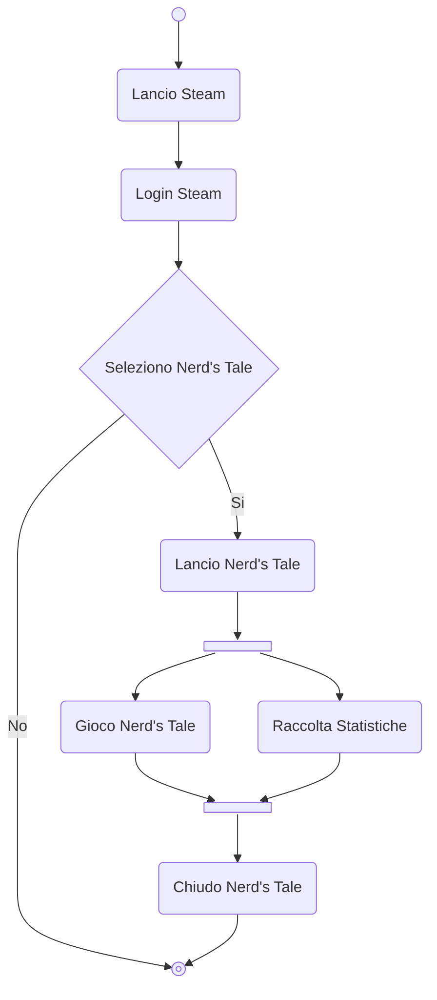

```mermaid
flowchart TB
    A@{ shape: sm-circ } --> B(Lancio Steam)
    B --> C(Login Steam)
    C --> D@{ shape: diamond, label: "Seleziono Nerd's Tale" }
    D --> |Si| E(Lancio Nerd's Tale)
    D --> |No| Z@{ shape: framed-circle }
    E --> F@{ shape: fork }
    F --> G(Gioco Nerd's Tale)
    F --> H(Raccolta Statistiche)
    G --> I@{ shape: fork }
    H --> I
    I --> L(Chiudo Nerd's Tale)
    L --> Z
```