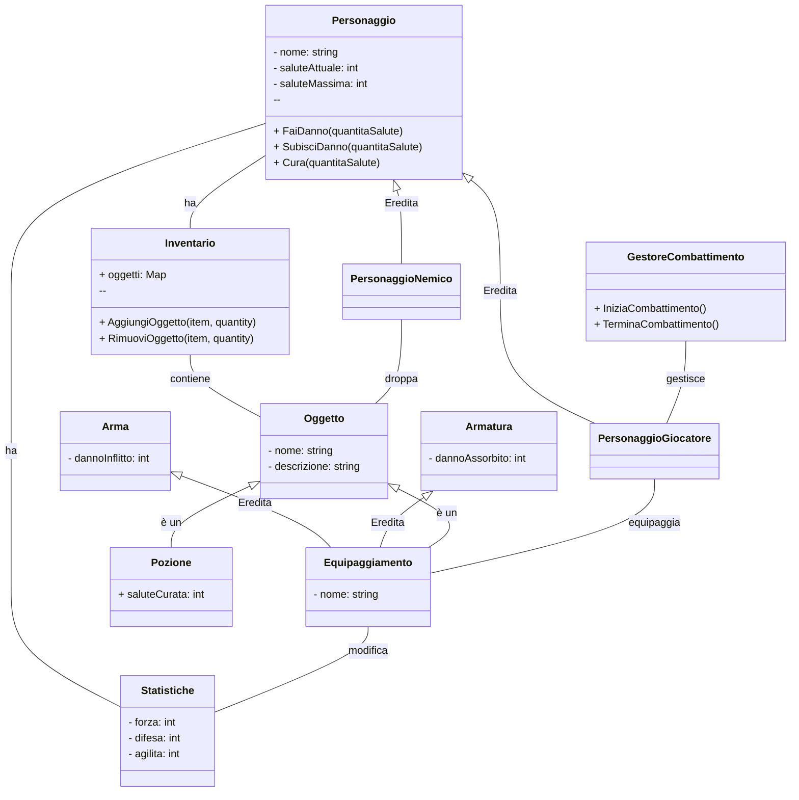

```mermaid
classDiagram
    class GestoreCombattimento {
        + IniziaCombattimento()
        + TerminaCombattimento()
    }

    class Personaggio {
        - nome: string
        - saluteAttuale: int
        - saluteMassima: int
        --
        + FaiDanno(quantitaSalute)
        + SubisciDanno(quantitaSalute)
        + Cura(quantitaSalute)
    }

    class PersonaggioGiocatore
    class PersonaggioNemico

    Personaggio <|-- PersonaggioGiocatore : Eredita
    Personaggio <|-- PersonaggioNemico : Eredita

    class Statistiche {
        - forza: int
        - difesa: int
        - agilita: int
    }

    class Oggetto {
        - nome: string
        - descrizione: string
    }

    class Equipaggiamento {
        - nome: string
    }

    class Pozione {
        + saluteCurata: int
    }

    class Arma {
        - dannoInflitto: int
    }

    class Armatura {
        - dannoAssorbito: int
    }

    Arma <|-- Equipaggiamento : Eredita
    Armatura <|-- Equipaggiamento : Eredita

    Oggetto <|-- Equipaggiamento : è un
    Oggetto <|-- Pozione : è un

    class Inventario {
        + oggetti: Map<Oggetto, int>
        --
        + AggiungiOggetto(item, quantity)
        + RimuoviOggetto(item, quantity)
    }

    GestoreCombattimento -- PersonaggioGiocatore : gestisce
    Personaggio -- Statistiche : ha
    Personaggio -- Inventario : ha
    PersonaggioGiocatore -- Equipaggiamento : equipaggia
    Inventario -- Oggetto : contiene
    PersonaggioNemico -- Oggetto : droppa

    Equipaggiamento -- Statistiche : modifica
```