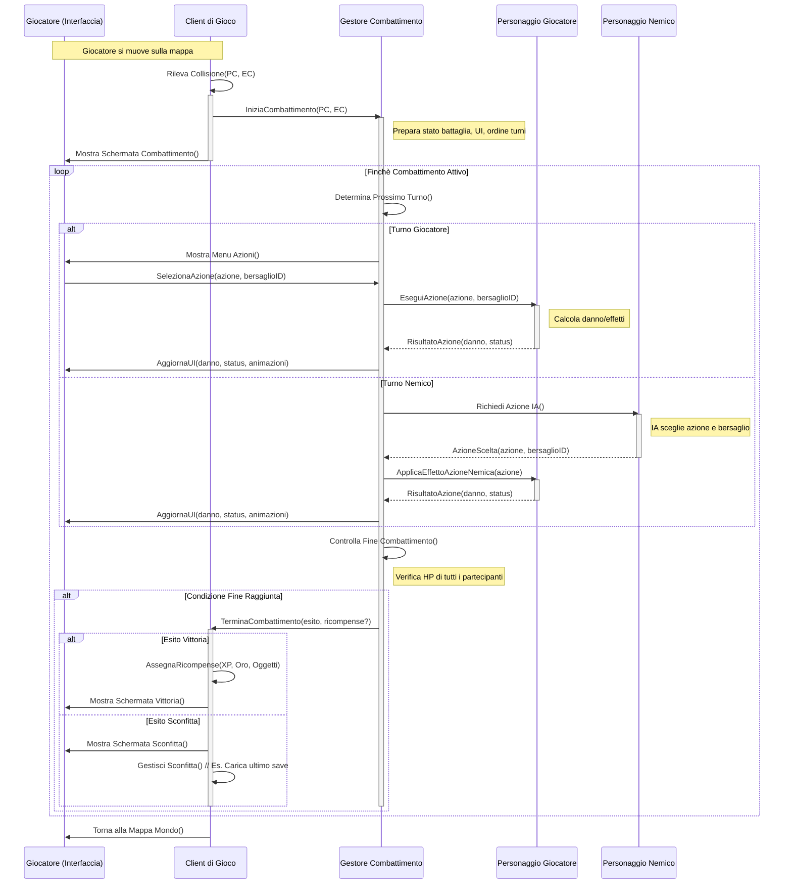

## Diagramma di sequenza per il caso d'uso "Gestione combattimento"

1. Si determinano i partecipanti al diagramma di sequenza.
2. Si stabiliscono la prima parte del flusso. In particolare:
    a. Il client rileva la collisione tra sprite del personaggio e del nemico.
    b. Se ciò avviene, si scatena il combattimento, ed il controllo passa al gestore del combattimento. Contestualmente, viene mostrata l'interfaccia di combattimento.
3. Si entra nel loop di combattimento, che dura finché questo è attivo.
4. Viene controllato il turno.
    a. Se è il turno del giocatore, il giocatore sceglie l'azione dall'UI, il sistema calcola il risultato, l'UI viene aggiornata, ed il turno termina.
    b. Se è il turno del nemico, l'IA sceglie l'azione, il sistema calcola il risultato, l'UI viene aggiornata, ed il turno termina.
5. Viene controllato il termine del combattimento.
    a. Il combattimento è terminato con esito vittoria.
    b. Il combattimento è terminato con esito sconfitta.
    c. Il combattimento prosegue.

QUI HO SCRITTO LA DOCUMENTAZIONE