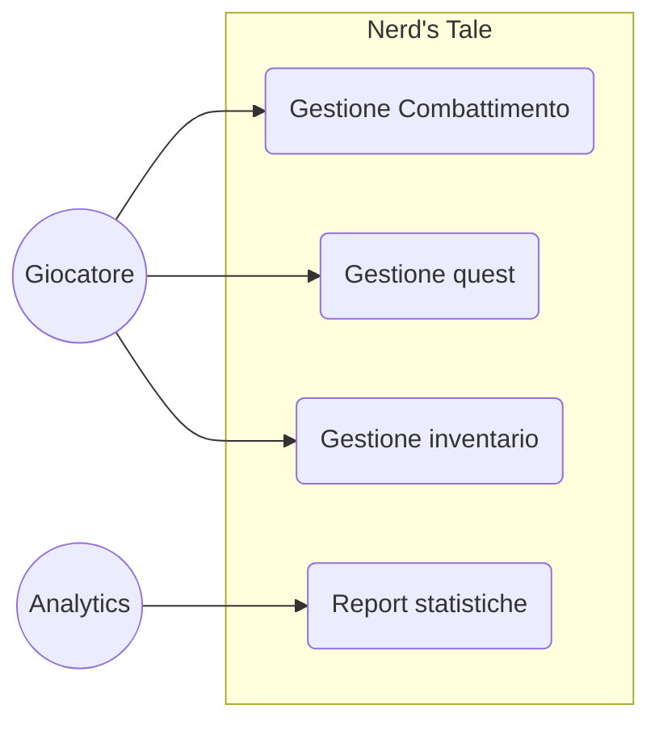

```mermaid
flowchart LR
    player((Giocatore))
    player --> B
    player --> C
    player --> D
    data((Analytics))
    data --> E
    subgraph Nerd's Tale
    B(Gestione Combattimento)
    C(Gestione quest)
    D(Gestione inventario)
    E(Report statistiche)
    end
```